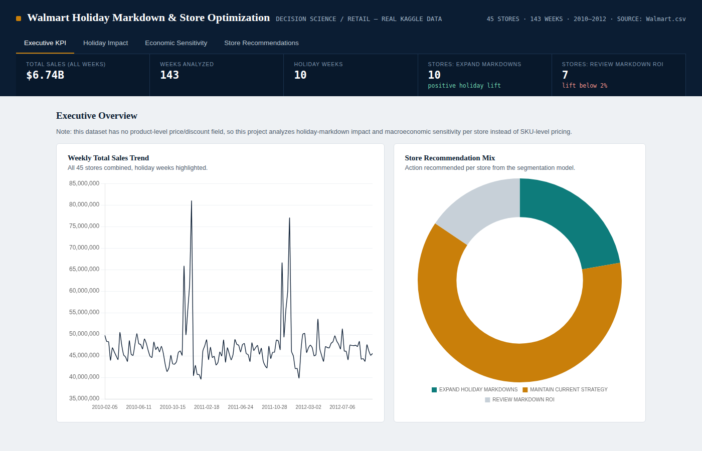
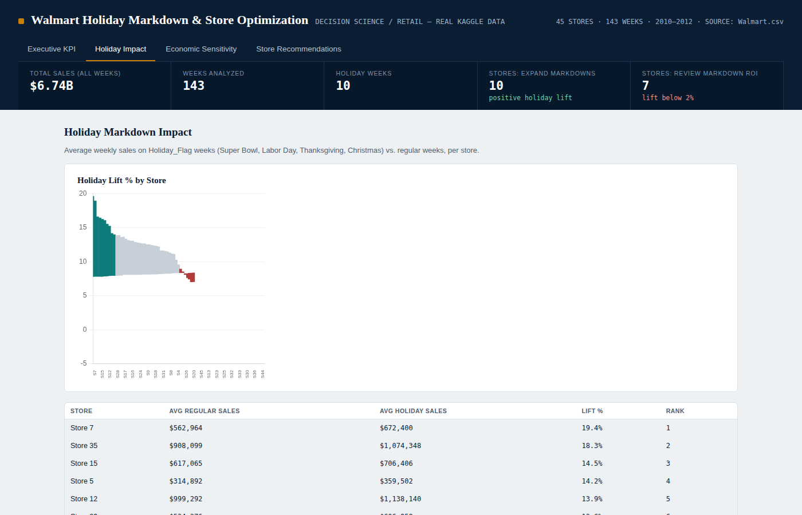
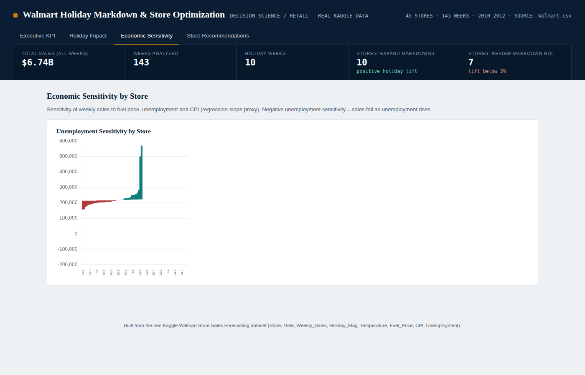
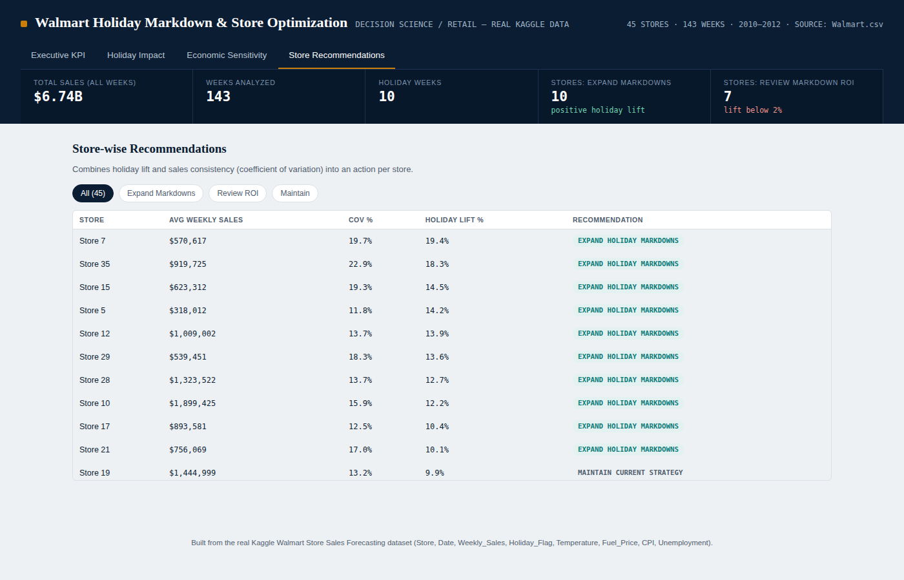

# Walmart Holiday Markdown & Store Optimization

**A decision-science project analyzing holiday markdown effectiveness and macroeconomic sensitivity across 45 Walmart stores**, built on the real Kaggle *Walmart Store Sales Forecasting* dataset. SQL-first (CTEs, window functions, views) with an interactive BI dashboard.

---

## The Problem

Retailers run markdowns during major holidays (Super Bowl, Labor Day, Thanksgiving, Christmas) assuming they drive sales — but not every store benefits equally, and not every market condition responds the same way. This project answers two questions per store:

1. **Did the holiday markdown actually work here?** (holiday lift %)
2. **What should we do about it?** (Expand / Review / Maintain)

## A Note on the Data

The source dataset (`Store, Date, Weekly_Sales, Holiday_Flag, Temperature, Fuel_Price, CPI, Unemployment`) is store-level weekly totals — **it has no product or price column**. So this isn't a SKU-level pricing/elasticity project; it's a store-level holiday-markdown and macroeconomic-sensitivity project, which is what the real data actually supports. `Holiday_Flag` is used as the promotion signal since it marks Walmart's known markdown weeks.

## Dashboard

**Executive KPI** — portfolio-level sales trend and the recommendation mix across all 45 stores



**Holiday Impact** — average sales on holiday (markdown) weeks vs. regular weeks, ranked by lift



**Economic Sensitivity** — how sensitive each store's sales are to unemployment, fuel price, and CPI



**Store Recommendations** — the final per-store action, filterable by recommendation type



> Open `dashboard/Walmart_Dashboard.html` directly in any browser to interact with it live — all data and charts are embedded, no server required.

## Methodology

| Step | SQL File | Technique | Output |
|---|---|---|---|
| 1. Holiday impact | `sql/01_holiday_impact.sql` | CTE + `RANK()` | Avg sales on holiday vs. regular weeks, per store |
| 2. Economic sensitivity | `sql/02_economic_sensitivity.sql` | CTE, covariance/variance slope | Sales sensitivity to fuel price, unemployment, CPI |
| 3. Store segmentation | `sql/03_store_segmentation.sql` | CTE + `NTILE()` | Expand Markdowns / Review ROI / Maintain, per store |
| 4. Reporting layer | `sql/04_views.sql` | Views | Governed layer the dashboard/BI tools connect to |

## Key Findings

- **Store 7** shows the strongest holiday lift (+19.4%) — a candidate to deepen or extend markdowns further.
- **10 of 45 stores** are flagged **Expand Holiday Markdowns** (lift ≥ 10%); **7 stores** are flagged **Review Markdown ROI** (lift < 2%) — the discount isn't earning its keep there.
- Sensitivity to local unemployment varies sharply by store — some stores' sales move a lot with the local economy, others barely react.

## Project Structure

```
walmart_project/
├── README.md
├── data/                Walmart.csv (source) + walmart_project.db (SQLite)
├── sql/                 4 files: holiday impact, economic sensitivity, segmentation, views
├── dashboard/            Walmart_Dashboard.html — self-contained, open in any browser
├── docs/screenshots/     dashboard screenshots used above
└── scripts/              build_db.py, run_all_sql.py, build_dashboard.py
```

## How to Run

Requires Python 3 only (standard library — no installs needed).

```bash
git clone https://github.com/nagashreeavd/Walmart-holiday-pricing-project.git
cd Walmart-holiday-pricing-project
python3 scripts/build_db.py        # loads Walmart.csv into SQLite
python3 scripts/run_all_sql.py     # runs all SQL, exports CSVs
python3 scripts/build_dashboard.py # rebuilds the dashboard HTML
```

Then open `dashboard/Walmart_Dashboard.html` in your browser. Or skip straight to it — the repo already ships with the dashboard pre-built.

To explore the SQL directly:
```bash
sqlite3 data/walmart_project.db
sqlite> .read sql/03_store_segmentation.sql
```

## Tech

Python (stdlib only) · SQLite · SQL (CTEs, window functions, views) · Chart.js · vanilla HTML/CSS/JS
